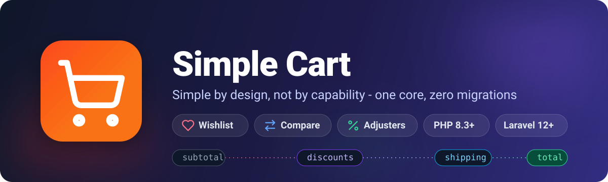

<p align="center">
  
</p>

# Simple Cart

Simple by design, not by capability. Корзина, закладки и сравнение товаров для Laravel 12 и 13 (PHP 8.3+).

Каждый список (корзина, закладки, сравнение, свои списки) - один и тот же примитив с политикой из конфига. Деньги считает только корзина, и делает это через конвейер классов-корректировок. Без магических строк и без float.

## Установка

```bash
composer require timurturdyev/simple-cart
php artisan migrate
php artisan vendor:publish --tag=simple-cart-config   # по желанию
```

Провайдер и миграции подхватываются автоматически. По умолчанию корзина в базе, гость узнается по cookie.

## Быстрый старт

```php
use TimurTurdyev\SimpleCart\Facades\Cart;
use TimurTurdyev\SimpleCart\Facades\Compare;
use TimurTurdyev\SimpleCart\Facades\Wishlist;

$line = Cart::add($item, quantity: 2, options: ['size' => 'm']);

Cart::setQuantity($line->id, 5);
Cart::stepQuantity($line->id);      // кнопка "+": шаг из правила количества
Cart::total();                // Price: ->minor(), ->decimal(), ->format()

Wishlist::toggle($item);      // первый вызов добавляет, второй убирает
Wishlist::has($item);         // для кнопки-сердечка
Wishlist::moveToCart($item);

Compare::add($item);          // лимит берется из конфига
```

`$item` - любая модель, реализующая `Purchasable`:

```php
use TimurTurdyev\SimpleCart\Contracts\Purchasable;
use TimurTurdyev\SimpleCart\Support\Price;

class Chair extends Model implements Purchasable
{
    public function cartId(): string|int
    {
        return $this->id;
    }

    public function cartName(): string
    {
        return $this->name;
    }

    public function cartPrice(): Price
    {
        return Price::fromMinor($this->price);
    }
}
```

Без модели строка собирается вручную:

```php
use TimurTurdyev\SimpleCart\Line;

Cart::add(Line::of(11, 'Chair', Price::fromDecimal('19.99'), quantity: 2));
```

## Идентичность строки

Id строки = hash(id товара + нормализованные опции). Один товар с разными опциями сам раскладывается по разным строкам, составные id вручную склеивать не нужно:

```php
Cart::add($item, options: ['size' => 'm']);
Cart::add($item, options: ['size' => 'l']);    // вторая строка

Cart::has($item, options: ['size' => 'm']);    // true
```

Ключ только по части опций:

```php
'cart' => ['policy' => 'append', 'key_options' => ['size']],

Cart::add($item, options: ['size' => 'm', 'label' => 'Хит']);
Cart::add($item, options: ['size' => 'm', 'label' => 'Новинка']);   // та же строка
```

Данные вне идентичности (зафиксированная картинка, метка времени) живут в `meta`:

```php
$line = Cart::add($item, meta: ['image' => $url]);

$line->meta('image');
$line->model();     // ленивый поиск модели по классу товара
Cart::models();     // все модели списка одним запросом на тип
```

Результат `model()` запоминается на время жизни строки, а `models()` греет этот кэш сразу для всего списка.

## Деньги

Суммы хранятся в целых минорных единицах внутри value-объекта `Price`. Конверсия в одной точке, округление half-up:

```php
Price::fromMinor(1999);        // 19.99
Price::fromDecimal('19.99');   // строка парсится точно

Cart::total()->minor();        // 1999
Cart::total()->format();       // "19.99"
```

## Скидки, сборы, доставка

```php
use TimurTurdyev\SimpleCart\Adjusters\PercentageDiscount;
use TimurTurdyev\SimpleCart\Adjusters\Shipping;

Cart::adjust(
    new PercentageDiscount('summer', percent: 10),
    new Shipping(Price::fromMinor(1500)),
);

Cart::removeAdjuster('summer');
Cart::totals()->breakdown();    // subtotal, каждая корректировка, total
```

В комплекте: `PercentageDiscount`, `FixedDiscount`, `PercentageFee`, `Shipping`. Корректировки применяются конвейером: каждая видит текущий total, поэтому последовательные скидки компаундятся и порядок важен. Своя корректировка - один класс:

```php
use TimurTurdyev\SimpleCart\Contracts\Adjuster;
use TimurTurdyev\SimpleCart\Support\Totals;

final readonly class GiftWrap implements Adjuster
{
    public function __construct(private Price $amount)
    {
    }

    public function name(): string
    {
        return 'gift-wrap';
    }

    public function adjust(Totals $totals): Totals
    {
        return $totals->addFee($this->name(), $this->amount);
    }

    public function toArray(): array
    {
        return ['amount' => $this->amount->minor()];
    }

    public static function fromArray(array $data): static
    {
        return new self(Price::fromMinor($data['amount']));
    }
}
```

Между запросами корректировки хранятся парами `{class, data}` и восстанавливаются с проверкой контракта. `unserialize` не используется.

## Списки

```php
'lists' => [
    'cart' => ['policy' => 'append'],
    'wishlist' => ['policy' => 'toggle'],
    'compare' => ['policy' => 'toggle', 'limit' => 4],
    'viewed' => ['policy' => 'toggle', 'limit' => 20],
],
```

| политика | поведение |
|---|---|
| `append` | повторное добавление суммирует количество |
| `toggle` | повторный `add` ничего не меняет, `toggle()` убирает |
| `limit` | новая строка сверх лимита кидает `ListLimitException` |

Новый тип списка - строка в конфиге, а не новый класс:

```php
use TimurTurdyev\SimpleCart\CartManager;

app(CartManager::class)->list('viewed')->toggle($item);

Cart::moveTo('wishlist', $line->id);   // отложить на потом
Wishlist::moveToCart($item);
```

## Правила количества

```php
use TimurTurdyev\SimpleCart\Contracts\HasQuantityRule;
use TimurTurdyev\SimpleCart\Support\QuantityRule;

class Box extends Model implements Purchasable, HasQuantityRule
{
    public function cartQuantityRule(): QuantityRule
    {
        return new QuantityRule(min: 66, step: 66, max: 660);
    }
}

'cart' => ['policy' => 'append', 'quantity' => ['min' => 1, 'step' => 1, 'max' => 99]],
```

```php
Cart::add($box);                    // 66
Cart::add($box, quantity: 70);      // QuantityRuleException: min, step, max, given
Cart::stepQuantity($line->id, -1);  // минус шаг, ниже min строка уходит

## Хранилище

По умолчанию session: работает сразу после установки, пустые списки не оставляют записей. Переключение на базу - одна строка конфига:

```php
'storage' => 'database',
```

```bash
php artisan vendor:publish --tag=simple-cart-migrations
php artisan migrate
```

При логине гостевая корзина сливается с корзиной пользователя. Стратегии: `sum` (количества складываются), `keep` (строки пользователя важнее), `replace` (гостевая заменяет). Сливать умеют драйверы с `SupportsOwnerMerge` (database умеет из коробки), с остальными листенер просто пропускает логин.

Свой драйвер подключается снаружи, без правки пакета:

```php
use TimurTurdyev\SimpleCart\Storage\StorageManager;

app(StorageManager::class)->extend('redis', fn () => new RedisCartStorage());
```

Под нагрузкой добавьте сквозной кэш (секция `cache` конфига): ключ на корзину, чтение с прогретым ключом до базы не доходит. Работает с любым драйвером, кастомным тоже.

## Идентичность корзины

За владельца корзины отвечает слой `CartIdentity`. По умолчанию сессия. Нужна гостевая корзина дольше сессии - ставьте cookie-драйвер:

```php
'identity' => [
    'driver' => 'cookie',
    'cookie' => [
        'name' => env('SIMPLE_CART_COOKIE', 'simple_cart_id'),
        'ttl_minutes' => 60 * 24 * 30,
    ],
],
```

Cookie ставится лениво, при первой реальной записи: гость с пустой корзиной cookie не получит. Залогиненного пользователя определяет auth id. Шифрование - штатный `EncryptCookies` приложения.

Свой вариант подключается через `IdentityManager::extend()`, как у хранилища.

## События

`LineAdded`, `LineUpdated`, `LineRemoved`, `ListCleared`. В каждом - имя списка и строка. Отключаются через `'events' => false`.

## Оформление заказа

Заказ - зона приложения: модель, статусы, оплата и нумерация живут на его стороне. Пакет отдает снапшот корзины и очищает ее:

```php
use Illuminate\Support\Facades\DB;
use TimurTurdyev\SimpleCart\Facades\Cart;
use TimurTurdyev\SimpleCart\Line;
use TimurTurdyev\SimpleCart\Support\Price;

$order = DB::transaction(function () {
    $breakdown = Cart::totals()->breakdown();

    $order = Order::create([
        'lines' => Cart::items()->map(fn (Line $line): array => $line->toArray())->values()->all(),
        'subtotal' => $breakdown['subtotal']->minor(),
        'adjustments' => array_map(fn (Price $amount): int => $amount->minor(), $breakdown['adjustments']),
        'total' => $breakdown['total']->minor(),
    ]);

    Cart::clear();

    return $order;
});
```

Цены зафиксированы в момент `add()` и лежат в минорных единицах - подорожание товара между добавлением и оформлением на заказ не влияет. Скидки в снапшоте отрицательные, поэтому `subtotal + adjustments = total`. `clear()` шлет `ListCleared` - удобная точка для аналитики. Сценарий закреплен тестом `tests/CheckoutRecipeTest.php`.

## Аналитика и брошенные корзины

Таблица `simple_cart_lists` открыта для чтения: колонки `owner`, `list`, `payload` и таймстампы, формат меняет разве что мажорная версия.

Брошенные корзины админка находит SQL-запросом по `updated_at`. Внутрь payload пускают json-функции БД и модель `TimurTurdyev\SimpleCart\Storage\CartRecord`. Цены в минорных единицах, курсов валют тут нет.

## Переход с darryldecode/laravelshoppingcart

Таблица соответствия API и рецепт переноса данных - в [UPGRADE.md](UPGRADE.md). Встроенного импорта нет: старые корзины переносит одноразовый скрипт приложения через `forOwner($ownerId)->write(...)`, id владельцев не меняются, живые cookie продолжают находить свои корзины.

## Тесты

```bash
make check
```

## Лицензия

MIT. См. [LICENSE.md](LICENSE.md).
